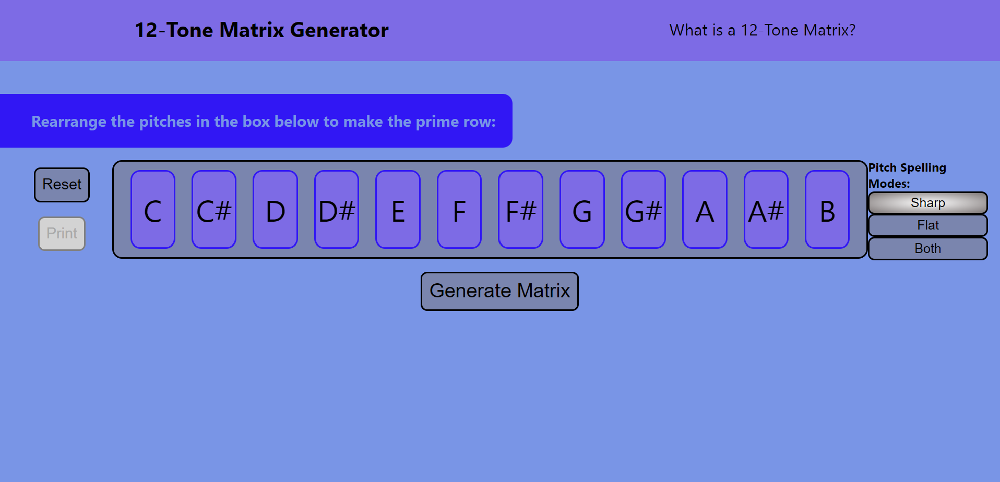
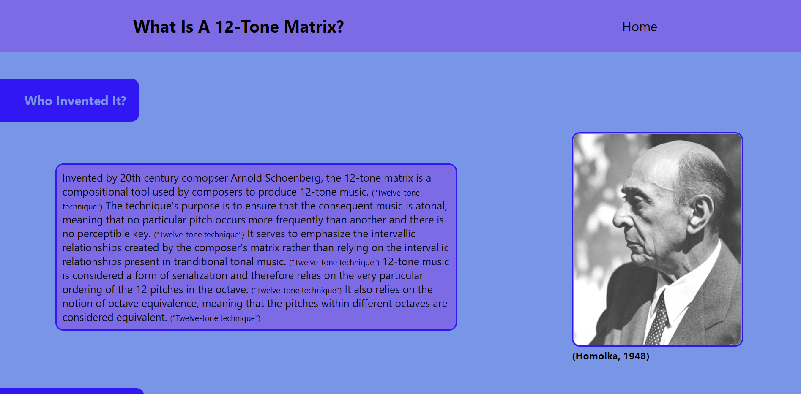
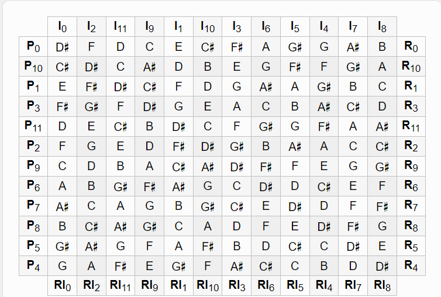
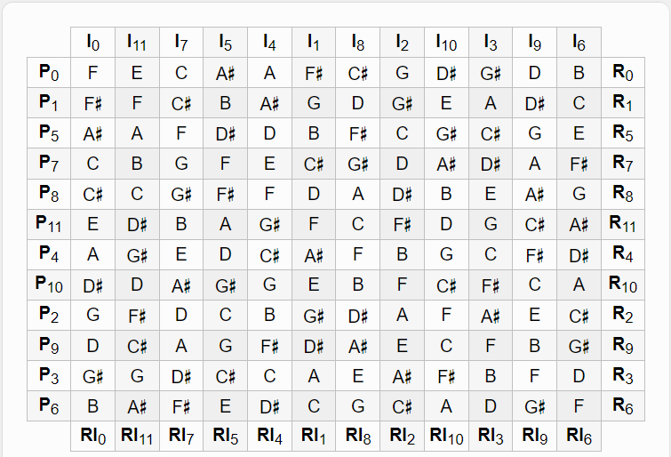

# 12-Tone Matrix Generator

## Description
The goal for this project was to create a compositional tool (12-tone matrix) that enables composers to create 12-tone music.
This project enabled me to practice HTML, CSS and JavaScript. It also allowed me to practice designing user interfaces, writing code that meets accessibility requirements, refactor and simplify large amounts of code, and create responsive web pages.  

## Usage
* Rearrange the pitches in the row to create your prime row. Click two pitches to swap them.
* Click the generate button to generate the matrix for your row.
* Click the print button to open the print dialog box.  The print button is disabled when the matrix is hidden.
* Click the reset button to change the row back to it's original state and hide the matrix.
* Click the spelling mode buttons to respell accidentals in sharps, flats, or both.
* Click the play buttons within the matrix to play the rows.  You can play one row at a time and stop playing at any time by clicking the stop button.
* Click the "What is a 12-Tone Matrix?" link at the top of the page to be taken to a page all about twelve tone music.

## Built With
* HTML
* CSS
* JavaScript

## Website
Main page:

About page:

Deployed Page: https://mirandal27.github.io/12-Tone-Matrix-Generator/

## Test Cases
Prime Row: D#, F, D, C, E, C#, F#, A, G#, G, A#, B
Expected Output:

Prime Row: F, E, C, A#, A, F#, C#, G, D#, G#, D, B
Expected Output:

Prime Row: C, C#, D, D#, E, F, F#, G, G#, A, A#, B
Expected Output:

## Credits/Sources
Site created by - Miranda Lane

Wikimedia Foundation. (2021, October 9). Twelve-tone technique. Wikipedia. Retrieved November 13, 2021, from https://en.wikipedia.org/wiki/Twelve-tone_technique. 

Richardson. (n.d.). Lessons ten, eleven &amp; twelve - serialism. Music Class Hub. Retrieved November 13, 2021, from https://musicclasshub.weebly.com/lessons-ten-eleven--twelve---serialism.html. 

Hutchinson, R. (n.d.). Music theory for the 21st-century classroom. Twelve-Tone Technique. Retrieved November 13, 2021, from https://musictheory.pugetsound.edu/mt21c/TwelveToneTechnique.html. 

Oglesby, &amp; Instructables. (2017, November 6). Create a twelve-tone melody with a twelve-tone matrix. Instructables. Retrieved November 13, 2021, from https://www.instructables.com/Create-a-Twelve-Tone-melody-with-a-Twelve-Tone-Mat/. 

